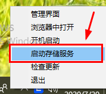

# 如何将本地电脑作为存储端设备绑定？

**1.请先安装易有云客户端，并正常开启运行。**

**2.Windows端(以Win10为例)：点击任务栏中易有云图标，右键即可展开易有云菜单栏，点击“启动存储服务”，即可打开易有云向导页面（网页）；**

**2-1.Mac端：单击易有云图标，即可展开易有云菜单栏，点击“启动存储服务”，即可打开易有云向导页面（网页）；**

 <strong> *登录时，请使用客户端登录账号，否则无法绑定！</strong>

**4.设置好名称及初始目录路径后，点击"确定"即可绑定！**

*初始目录路径为用户电脑本机上的任一文件夹路径；

**4.绑定完成后，即可将本机作为存储端设备远程管理访问数据！**

