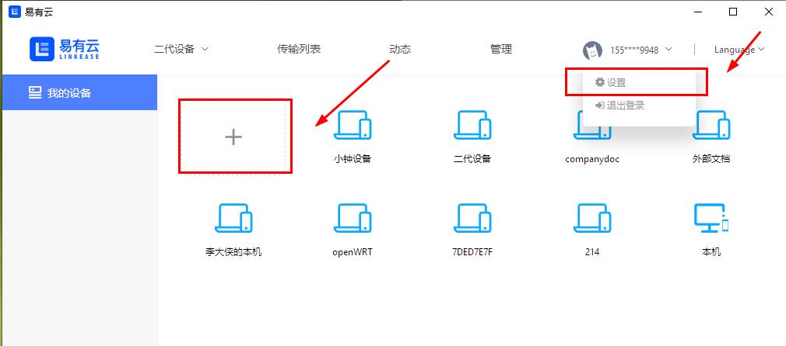
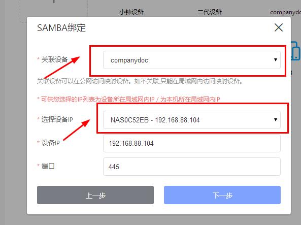
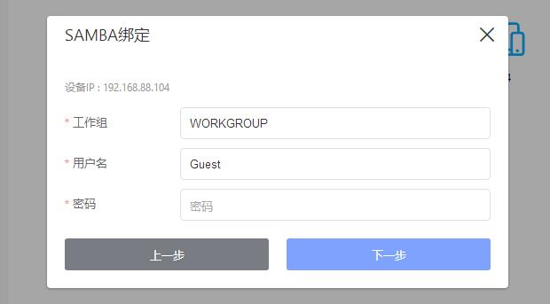
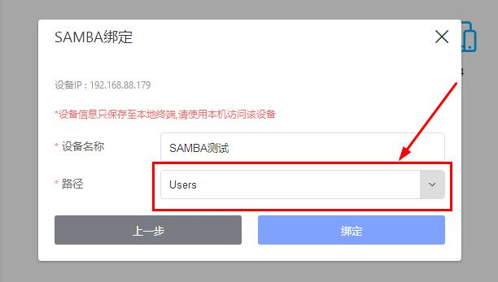
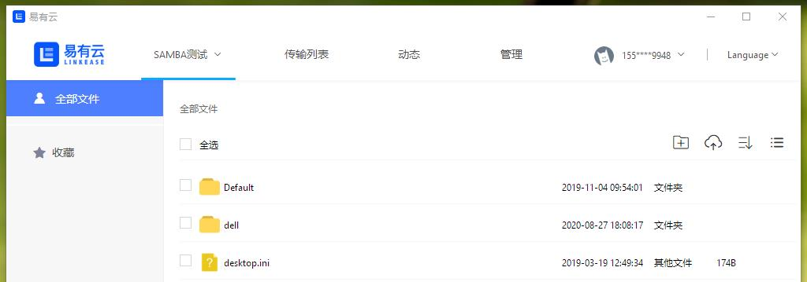

# 如何用易有云连接SAMBA远程访问设备文件？
<blockquote>
连接前，请手动更新存储端与客户端到最新版本； 

版本更新： [https://www.ddnsto.com/linkease/download/#/](https://www.ddnsto.com/linkease/download/#/)
</blockquote>

**使用场景举例：**

1. 家里路由器安装了易有云 
2. 家里还运行了一台开启了 Samba 服务的设备，且设备上不方便直接安装易有云存储端 
3. 人在公司，需要家里这个 Samba 服务里面的文件

<blockquote>
 已知玩客云、小米硬盘路由不支持，因为他们的 SAMBA 是 1.0 版本，无法支持。目前易有云支持的是 2.x ~ 3.x 版本 
</blockquote>

**前期准备：**

1. 路由器正常运行易有云 
2. SAMBA设备正常运行 
3. PC登录易有云客户端（非存储端！非存储端！非存储端）

**绑定流程：**

**1.鼠标悬浮头像上方，在出现的悬浮框中选择“设置”，进入设备管理页面。点击“添加设备”按钮，在出现的弹窗中，选择“SAMBA协议”。**

**2.选择关联设备，设备IP为选填项（可选择也可手动输入），建议选择IP，这样数据更准确。**
<blockquote>
SAMBA 用户名密码，易有云只存本地客户端，不会存服务器。即使是服务器管理人员，也无法知道密码信息，保证个人数据安全。但就是每个客户端都得单独添加一次。；
</blockquote>

**①如果选择了关联设备，那么通信方式如下：**

也就是说，你的本地客户端通过连接关联设备访问到 SAMBA 设备 IP，即在任何外网网络易有云都能保证能连接到 SAMBA。

**②如果不关联设备，那么：**

客户端必须跟 SAMBA 在一个局域网才能访问到 SAMBA 设备。

**端口默认为445，可更改。点击下一步；**

**3.填写工作组，SAMBA设备 用户名和密码，点击下一步；**

**4.填写SAMBA设备 名称及目标路径，目标路径为选填项（可选择也可手动输入），点击绑定；**

<blockquote>
目标路径即为您要访问的SAMBA设备的共享目录
</blockquote>

**5.绑定成功后，该虚拟设备出现在“我的-设备管理”列表页面。您可在“文件”页面访问该虚拟设备中的文件；**

<blockquote>
SAMBA协议绑定的设备均为虚拟设备，除文件管理外，其他功能均不可用；
</blockquote>

